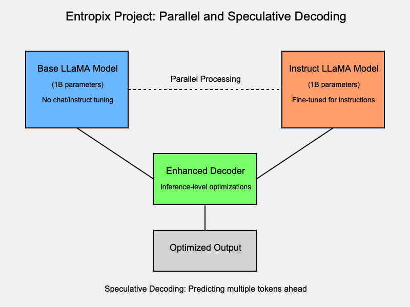
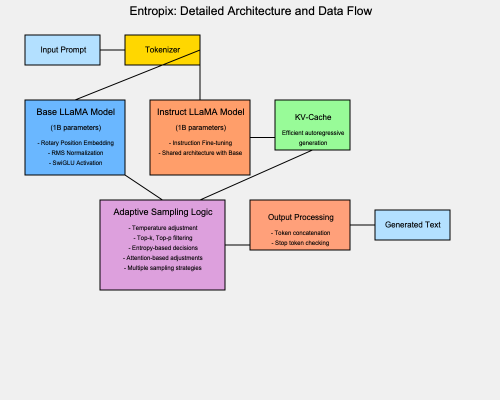
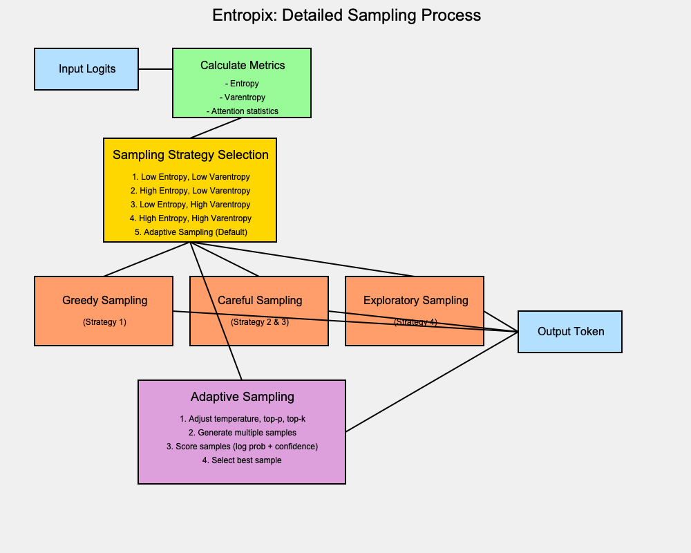

# entropix-annotated

* forked from [xjdr-alt/entropix](https://github.com/xjdr-alt/entropix)
* annotated by several different claude's (3.5 sonnet and opus together) following my lead, possibly making errors along the way, but sanity check looks good
* i like the idea of appending <thought> tags to each pass of the code and comments together, especially with different LLMs and simulations of them
* will need to probably implement comment timestamps and other metadata.
  * ex: sonnet 3.5, after reading a [Stanford paper on adaptive inference-time compute](https://arxiv.org/abs/2410.02725)
  * ex2: opus reading sonnet's notes with a skeptical hat on after given a long list of overhyped/mishyped trends in LLMs over the years
* added a cli for prompt loading for pytorch, here's an example: `python entropix/torch_main_cli.py --prompt-file ./entropix/data/prompts2.csv --prompt-test`

# goals of this fork

* make a more accessible entrypoint for people hearing about entropix
* annotate the code and document the 'why'
* annotate and document with an often 'skeptical' point of view, given the immense amount of hype that comes with every trend in the LLM space (note: this is healthy skepticism)
* drive more curiosity and ideas around parallel sampling and speculative decoding / draft models / tokenization tinkering
* showcase the power of base models vs. chat/instruct models
* create a starting point for others to continue

# contributing

* feel free to PR (or fork the fork) any additional comments/thoughts/tests that can be helpful
* the only new code should be tests, extensions, experiments, etc. while we are *not* creating a new library here, the more hackable and accessible we can make it, the better.
* fun tests and experiments are encouraged. the only requirement is curiosity and open sharing of ideas and research - including both what does and doesn't work in entropix itself

# more diagrams

